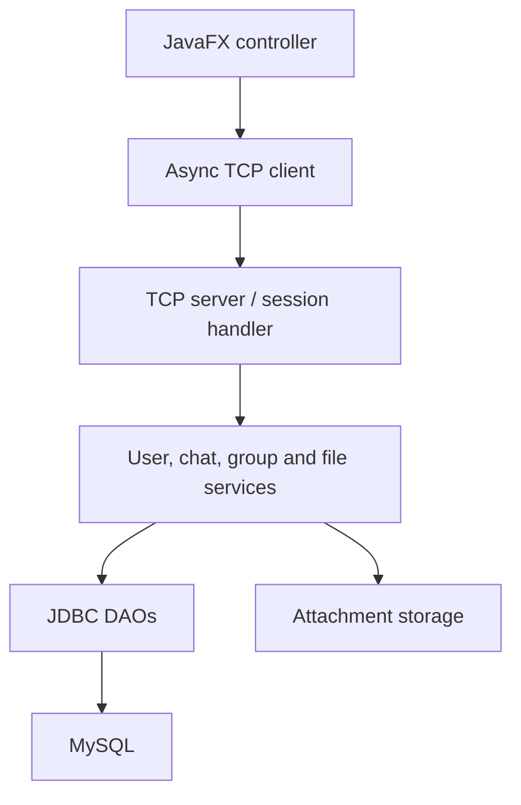
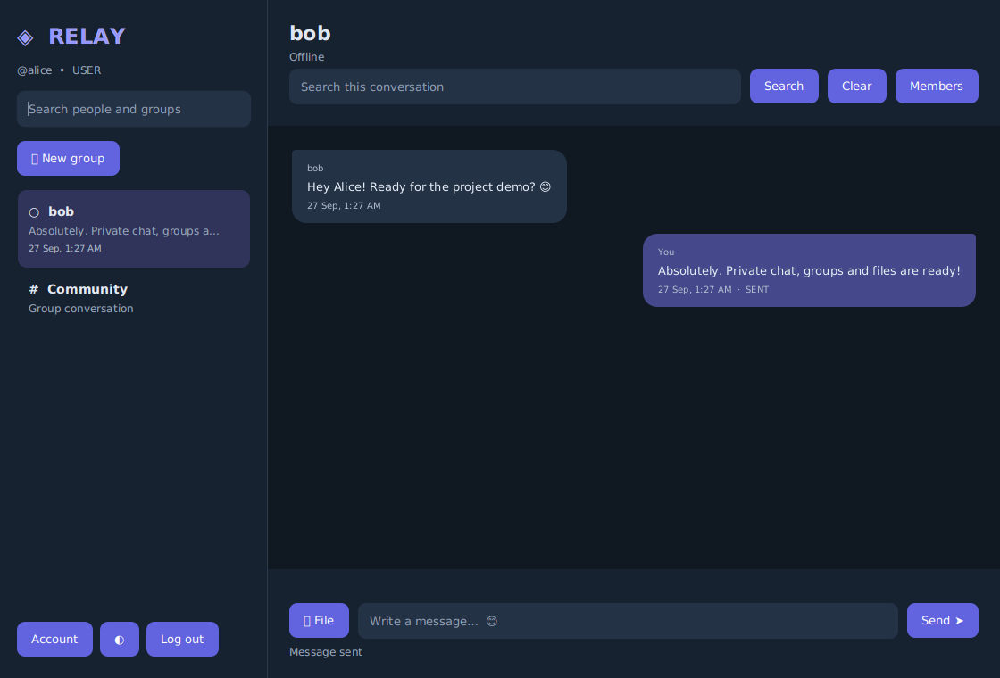

# Relay · Multi-Client Chat Application

A Java 17 desktop chat application upgraded from this repository's original Core Java console project. JavaFX clients talk to a standalone TCP server; JDBC persists accounts, conversations and receipts in MySQL. **No Spring Boot, React or WebSocket.**

## Features

- Registration, BCrypt login, account password changes and administrator disconnect controls.
- JavaFX desktop dashboard with dark/light themes, user/group search, conversation previews, time stamps and message bubbles.
- Private conversations, durable offline messages and recipient-acknowledged SENT → DELIVERED → SEEN status.
- Named groups, member lists, admin add/remove, leave and automatic admin transfer.
- Community group preserves the original broadcast-to-everyone behavior.
- Online/offline/last-seen presence, heartbeat expiry, throttled typing indicators and timeout clearing.
- Binary image/PDF/TXT/DOC/DOCX attachments up to 10 MiB, sanitized names and participant-only downloads.
- Case-insensitive partial message search within an authorized conversation; paginated chronological history.
- Bounded ExecutorService pools, thread-safe sessions, backpressure, request timeouts and graceful shutdown.
- JUnit unit, JDBC and real TCP integration tests; opt-in MySQL and JavaFX smoke tests.

## Stack and dependencies

| Component | Version / purpose |
| --- | --- |
| JDK | 17 or newer |
| JavaFX Controls + FXML | 17.0.12; programmatic controls and CSS |
| Maven | 3.8+ |
| MySQL Connector/J | 9.4.0; production persistence |
| jBCrypt | 0.4; salted BCrypt, cost 12 |
| Gson | 2.11.0; bounded UTF-8 JSON protocol metadata |
| JUnit Jupiter | 5.11.4 |
| H2 | 2.3.232; isolated tests only, not the application database |

## Quick start: Ubuntu

Install prerequisites:

```bash
sudo apt update
sudo apt install openjdk-17-jdk maven mysql-server
java -version
mvn -version
```

Clone this repository, switch to the upgrade branch if it has not been merged, then work from the repository root:

```bash
git clone https://github.com/najanrohit045/Multi-Client-Chat-Application.git
cd Multi-Client-Chat-Application
git switch upgrade/javafx-chat
```

### 1. Database setup

For a new v2 installation, run the schema once:

```bash
sudo mysql < schema.sql
sudo mysql
```

Inside the MySQL prompt, choose your own password in place of the example value:

```sql
CREATE USER 'chat_user'@'localhost' IDENTIFIED BY 'CHOOSE_A_LONG_UNIQUE_PASSWORD';
GRANT SELECT, INSERT, UPDATE, DELETE ON chat_app_v2.* TO 'chat_user'@'localhost';
EXIT;
```

`schema.sql` creates **chat_app_v2** and leaves the old **chat_app** untouched. It intentionally fails on an already initialized schema instead of silently treating incompatible tables as valid. For existing accounts/history, follow [the migration guide](docs/UPGRADE.md) before registering new users.

### 2. Start the server — terminal 1

```bash
export DB_URL='jdbc:mysql://localhost:3306/chat_app_v2?connectionTimeZone=UTC'
export DB_USERNAME='chat_user'
read -rsp 'MySQL password: ' DB_PASSWORD; echo
export DB_PASSWORD
mvn compile exec:java -Dexec.mainClass=network.ChatServer
```

The server prints `Chat server listening on /127.0.0.1:9090`. Keep this terminal open. Use Ctrl+C to shut down.

### 3. Start clients — terminals 2 and 3

Run this command in each terminal from the repository root:

```bash
mvn javafx:run
```

Create two different accounts and sign in. Select a person in the sidebar to open a private conversation, or create a group. Select **Community** to broadcast to everyone. One active connection per account is enforced.

To test offline delivery, close the receiving client, send a message, then sign in again. The database retains pending messages across server restarts. Open the conversation to mark them seen.

### 4. Run tests

```bash
mvn clean test
```

Default tests use isolated H2 databases and real loopback TCP sockets; no MySQL instance or display is required. The two environment-dependent checks are skipped unless explicitly enabled:

```bash
# Only against a disposable database initialized with schema.sql:
CHAT_TEST_MYSQL=true mvn test -Dtest=MySqlIntegrationTest

# Requires a graphical session (or an Xvfb display):
CHAT_TEST_UI=true mvn test -Dtest=UiSmokeTest
```

The MySQL check uses DB_URL/DB_USERNAME/DB_PASSWORD from your environment. The JavaFX test produces `target/ui-smoke.png`. See [validation evidence](docs/VALIDATION.md).

### Windows / IntelliJ / VS Code

Install JDK 17+, Maven and MySQL 8. Import `pom.xml` as a Maven project. Set DB_URL, DB_USERNAME and DB_PASSWORD in your server run configuration, then launch `network.ChatServer`; use Maven `javafx:run` for clients. In PowerShell, environment variables use `$env:DB_USERNAME='chat_user'`. The same Maven commands work on Windows. The JavaFX plugin resolves platform-specific JavaFX artifacts.

## Configuration

`.env.example` lists the settings. **The application reads exported environment variables or Java system properties; it does not automatically source `.env`.** Clients never need database credentials.

| Variable | Default | Used by |
| --- | --- | --- |
| DB_URL | jdbc:mysql://localhost:3306/chat_app_v2?connectionTimeZone=UTC | Server / migration |
| DB_USERNAME | chat_user | Server / migration |
| DB_PASSWORD | empty; set your own | Server / migration |
| CHAT_BIND | 127.0.0.1 | Server bind address |
| CHAT_HOST | 127.0.0.1 | Client destination |
| CHAT_PORT | 9090 | Both |
| CHAT_MAX_CLIENTS | 64 | Server |
| CHAT_FILES | server_files | Server attachment directory |

For a trusted LAN demo, set CHAT_BIND to the server's LAN address and CHAT_HOST to that address on clients. This implementation uses unencrypted TCP; BCrypt protects stored passwords, not network traffic. Use a trusted local network or an encrypted tunnel. TLS, end-to-end encryption and Internet-scale abuse controls are not implemented.

## Architecture



- `ChatController` handles views, forms and presentation state; it contains no SQL.
- `ChatClient` correlates futures with response IDs while independently dispatching push events.
- `ChatServer` owns bounded worker pools and a ConcurrentHashMap of authenticated sessions.
- `ClientHandler` derives sender identity from the socket session; clients cannot impersonate another sender.
- Services validate input and authorization, then call DAOs. `Sql.transaction` commits or rolls back multi-step writes.
- DAOs use PreparedStatement and try-with-resources. User profiles never include password hashes.

## Folder structure

```text
pom.xml
schema.sql
.env.example
README.md
docs/
  UPGRADE.md
  VALIDATION.md
src/main/java/
  app/          ChatApplication, MigrateLegacy
  controller/   ChatController
  dao/          UserDAO, MessageDAO, GroupDAO, GroupMessageDAO, AttachmentDAO
  database/     DBConnection, Sql
  exception/    ChatException
  model/        User, Message, ChatGroup, Member, Attachment
  network/      ChatServer, ChatClient, ClientHandler, Packet, FrameCodec
  service/      UserService, ChatService, GroupService, FileService
  util/         Config, FileManager
src/main/resources/css/chat.css
src/test/java/
  support/      TestDatabase
  service/      ServiceTest, MigrationTest
  network/      FrameCodecTest, SocketIntegrationTest
  integration/  MySqlIntegrationTest, UiSmokeTest
```

## Database design

| Table | Purpose |
| --- | --- |
| users | Unique username, BCrypt hash, USER/ADMIN role, presence and timestamps |
| messages | Sender/receiver foreign keys, content, SENT/DELIVERED/SEEN and receipt timestamps |
| chat_groups | Group name, creator and creation time; id 1 is Community |
| group_members | Composite group/user primary key, ADMIN/MEMBER and join time |
| group_messages | Group and sender foreign keys, content and timestamp |
| attachments | Exactly one private/group message association, metadata and opaque storage key |

All tables use utf8mb4 and foreign keys. Conversation, pending delivery and group history queries have indexes. `chat_groups` avoids the reserved word `GROUPS`. Message text contains no duplicated usernames. SQL joins resolve display names.

To promote an existing account, use a database administrator; registration never accepts a role:

```sql
USE chat_app_v2;
UPDATE users SET role='ADMIN' WHERE username='your_registered_username';
```

Sign out and back in. The Account dialog exposes audit events and disconnect controls. Audit files contain event metadata, never private conversation contents.

## TCP protocol

Each frame contains a big-endian 32-bit JSON byte count, UTF-8 JSON, a 32-bit binary byte count, then raw bytes. JSON is limited to 1 MiB and binary data to 10 MiB. File bytes are never encoded into chat commands or JSON. The transport reads exact lengths and rejects truncated/oversized frames.

Packet shape: `{"id":"request-uuid","type":"SEND","data":{"target":2,"group":false,"text":"Hello"}}`.

Responses repeat the request ID and use `OK` or `ERROR`. Server events use a null ID. History uses pages of 40 messages with an `after` ID; the client continues loading pages in chronological order.

| Commands | Purpose |
| --- | --- |
| REGISTER, LOGIN, PASSWORD, LOGOUT | Account lifecycle |
| USERS, GROUPS, SUMMARIES | Sidebar data |
| SEND, HISTORY, SEARCH, PENDING | Conversations |
| CREATE_GROUP, MEMBERS, ADD_MEMBER, REMOVE_MEMBER, LEAVE_GROUP | Group permissions |
| TYPING, STOP_TYPING | Debounced transient events |
| DELIVERED, SEEN | Recipient-only, monotonic acknowledgments |
| UPLOAD, DOWNLOAD | Binary attachments with authorization |
| PING | 20-second heartbeat; 70-second read timeout |
| KICK, AUDIT | Server-validated administrator actions |
| MESSAGE, RECEIPT, PRESENCE, GROUPS_CHANGED | Server push events |

SENT means committed to MySQL. DELIVERED requires recipient-client acknowledgment. SEEN requires viewing the conversation. Group messages currently show timestamps, not per-member receipt counts. After reconnect, the client reloads server history; it does not silently retry ambiguous sends that could duplicate messages.

## Threading, resources and security boundaries

Server capacity defaults to 64 concurrent sockets, with a fixed executor and one reader/writer task per connection. A semaphore prevents an unbounded accept queue. Per-session output queues disconnect slow consumers rather than blocking unrelated users. Client requests, file I/O and connection setup run outside the JavaFX thread; UI changes use Platform.runLater. Futures time out after 30 seconds.

Each DAO operation owns its JDBC connection. Multi-row group/file metadata changes use transactions. File names are sanitized; files are stored under random keys, and downloads recheck conversation participation. A removed group member cannot request its history or files. Group members can see existing group history when added. Files are downloaded, never automatically executed.

Limitations: single-server/single-session design; no TLS/E2EE; no attachment antivirus or content verification (type is inferred from extension); 10 MiB files are buffered in memory; no automatic reconnect or file resume; last-member group deletion can leave inaccessible physical files requiring storage maintenance; audit.log needs operator rotation. Presence is best-effort, with dead connections cleared after heartbeat expiry. This is a placement/demo application, not a claim of production hardening.

## Screenshots

The opt-in JavaFX smoke test generates an actual dashboard capture in `target/ui-smoke.png`. A reviewed example is included in [docs/dashboard.png](docs/dashboard.png).

 Replace/add screenshots here for your own demo accounts; never include real private conversations.

## Core Java concepts and interview Q&A

**How would you explain the project?**
“I upgraded a console-based multi-client chat system into a JavaFX desktop application. Clients communicate over raw TCP sockets. The server authenticates users with BCrypt, validates conversation permissions, and saves messages using JDBC and MySQL. ExecutorService handles multiple connections, while asynchronous events keep the UI responsive. I added private and group chats, offline delivery, receipts, typing status, file sharing and automated tests.”

**Why TCP sockets?** TCP provides an ordered byte stream. Our framing distinguishes messages and binary payloads because one socket read is not necessarily one complete packet.

**Why ExecutorService?** It manages worker lifecycle and bounds concurrency. A semaphore and bounded queues control resources; shutdown closes sockets to unblock waiting I/O.

**Why ConcurrentHashMap?** Multiple workers route messages and update sessions concurrently. Atomic session registration prevents duplicate-account races.

**Why JDBC and PreparedStatement?** JDBC communicates with MySQL directly. Parameter binding separates data from SQL and avoids injection; try-with-resources closes statements, result sets and connections.

**Why BCrypt?** Salted adaptive hashing avoids storing recoverable plaintext passwords. Registration hashes once; login verifies with checkpw. Hashing does not encrypt the TCP connection.

**How does offline delivery survive a restart?** Messages stay in MySQL with SENT status until the recipient acknowledges them. The server replays pending messages after authentication.

**How are private messages protected?** The session identifies the actor. History predicates include that actor, receipts require the real recipient, and group/file actions verify membership.

**Where are OOP and SOLID used?** Model records encapsulate data. Controllers, network classes, services and DAOs have separate responsibilities. GroupMessageDAO reuses shared message-query behavior. Functional interfaces in Sql abstract result mapping and transaction work without introducing a framework.

**How is the UI kept responsive?** Background executors perform network/disk tasks and CompletableFuture handles responses. Only view updates run on the JavaFX Application Thread.

**What would you improve next?** TLS, attachment streaming/scanning, persistent client outboxes with idempotency keys, connection pooling, history virtualization, per-member group receipts and scalable multi-server presence.
